``` {r}
#| include: false
library(formatR)
# These are some {knitr} options I typically use to format my **Quarto** documents in a consistent way. You should feel free to alter these or use other "chunk options" as you see fit!
# Sometimes, for example, you might want to suppress warnings or messages, and that behavior can be set for specific code chunks individually at the start of the code chunk.
knitr::opts_chunk$set(
  eval = TRUE, # run code in code chunks
  echo = TRUE, # render output of code chunks
  warning = TRUE, # do not suppress "warnings"
  message = TRUE, # do not suppress "messages"
  comment = "##", # prefix for comment lines
  prompt = TRUE, # prefix for code lines
  tidy = TRUE,
  tidy.opts = list(blank = FALSE, width.cutoff = 75),
  fig.path = "images/", # name of folder for images
  fig.align = "center" # centers any images on the page
)
```

## Introduction

This paper is looking into the structural, pharmacological, and therapeutic properties of a class of serotonin receptor (5-HT) agonists called 5-methoxytryptamines (5-MeO-Ts), particularly the 5-HT1A and 5-HT2A agonist 5-methoxy-N,N-dimethyltryptamine (5-MeO-DMT). The exact structure of 5-MeO-DMT was mapped out, as well as how it fits in and affects the conformation of the 5-HT1A and 5-HT2A receptors, using cryogenic electron microscopy. Its pharmacological properties were determined using in vitro 5-HT1A and 5-HT2A receptor activity assays, and in vivo behavioral/therapeutic properties measured using wild-type mice include head twitching, sucrose preference, locomotor activity, social interaction, anxiety, and susceptibility to stress.

5-MeO-DMT's properties were compared with other 5-HT receptor agonists, such as the pan-serotonergic agonist lysergic acid diethylamide (LSD), the full serotonergic agonist mescaline, clinically-used 5-HT1A agonists, and other 5-MeO-Ts. The 5-MeO-Ts, including 5-MeO-DMT, were paired with the 5-HT1A-specific antagonist WAY-100635 in some of the in vivo experiments in order to show that the compounds' effects were due to 5-HT1A activity specifically.

5-MeO-DMT was found to be a full 5-HT1A agonist and a partial 5-HT2A agonist, with relatively moderate potency; This was confirmed with head twitch observation following administration of 5-MeO-DMT with and without WAY-100635. However, 4-fluoro,5-methoxy-N,N-pyrrolidinyl-tryptamine (4-F,5-MeO-PyrT), which is also a full 5-HT1A agonist but has less activity at 5-HT2A, did not seem to activate 5-HT2A to behaviorally significant levels, and it was still able to restore social interaction in socially stressed mice.

The larger point this paper is trying to make is that many of the therapeutic effects seen in antidepressive, antipsychotic, and anti-anxiety serotonergic medications are likely mainly attributed to their activity at the 5-HT1A receptor, not the 5-HT2A receptor (which is responsible for sensory disturbances associated with serotonergic medication); therefore, 5-HT1A-specific compounds may be the answer to alleviating these side effects.

I will be replicating the behavioral data in Figures 5d-e and Extended Data Figures 7d-h, since these are the only data in which statistical tests were done beyond standard error calculation. Figure 5b will be used for an example of the visualization analysis.

## Visualization of Data

First, let's load in our essential libraries:

``` {r}
library(readxl)
library(tibble)
library(tidyr)
library(dplyr)
library(janitor)
library(ggplot2)
library(car)
library(agricolae)
```

And now we can load in our data, starting with Figure 5:

``` {r}
#| out-width: "100%"
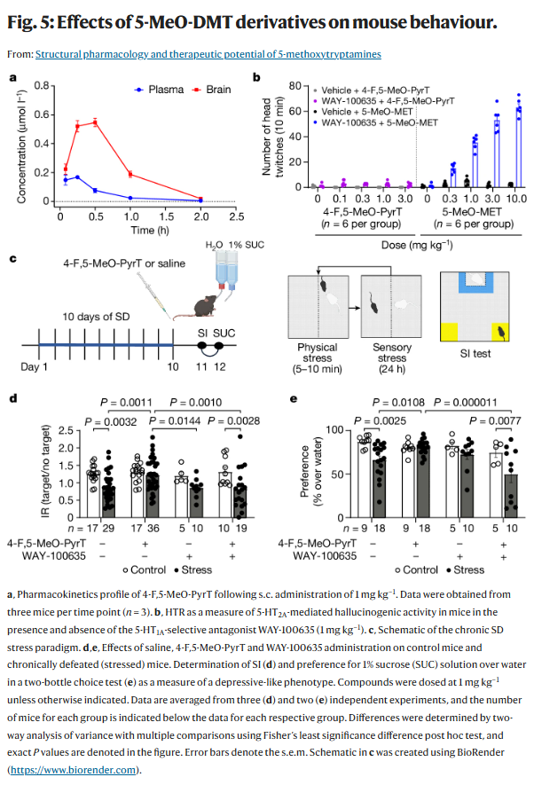
```

Let's read in the associated data tables, starting with Figure 5b:

``` {r}
f <- read_excel(path = "data/41586_2024_7403_MOESM5_ESM.xlsx", sheet = "Fig 5", range = "C14:O19", col_names = FALSE, col_types = "text", .name_repair = "unique_quiet") # reads in the data table we need specifically
f <- t(f) # swaps columns with rows, so we can work with the table easier
f <- row_to_names(f, row_number = 1) # assigns proper names to columns
vehmeo <- rep("Vehicle + 4-F,5-MeO-PyrT", times = 6)
waymeo <- rep("WAY-100,635 + 4-F,5-MeO-PyrT", times = 6)
treatment <- append(vehmeo, values = waymeo)
f[1:12] = treatment # fills out missing values for stress condition
f <- as_tibble(f, .name_repair = "universal_quiet") # converts table to a format we can work with easier
f1 <- f %>%
  select(..4.F..5.MeO.pyrT..Dose..mg.kg., ...0) %>%
  mutate(Treatment = ..4.F..5.MeO.pyrT..Dose..mg.kg., Head.Twitch.Response = as.numeric(...0)) %>%
  filter(!is.na(Head.Twitch.Response))
f1 <- f1 %>%
  mutate(Dosage = rep("0", times = nrow(f1))) %>%
  select(Treatment, Dosage, Head.Twitch.Response) # separates all data points since each one is from a different subject, and makes an extra column that keeps track of treatment condition
f2 <- f %>%
  select(..4.F..5.MeO.pyrT..Dose..mg.kg., ..0.1) %>%
  mutate(Treatment = ..4.F..5.MeO.pyrT..Dose..mg.kg., Head.Twitch.Response = as.numeric(..0.1)) %>%
  filter(!is.na(Head.Twitch.Response))
f2 <- f2 %>%
  mutate(Dosage = rep("0.1", times = nrow(f2))) %>%
  select(Treatment, Dosage, Head.Twitch.Response)
f3 <- f %>%
  select(..4.F..5.MeO.pyrT..Dose..mg.kg., ..0.3) %>%
  mutate(Treatment = ..4.F..5.MeO.pyrT..Dose..mg.kg., Head.Twitch.Response = as.numeric(..0.3)) %>%
  filter(!is.na(Head.Twitch.Response))
f3 <- f3 %>%
  mutate(Dosage = rep("0.3", times = nrow(f3))) %>%
  select(Treatment, Dosage, Head.Twitch.Response)
f4 <- f %>%
  select(..4.F..5.MeO.pyrT..Dose..mg.kg., ...1) %>%
  mutate(Treatment = ..4.F..5.MeO.pyrT..Dose..mg.kg., Head.Twitch.Response = as.numeric(...1)) %>%
  filter(!is.na(Head.Twitch.Response))
f4 <- f4 %>%
  mutate(Dosage = rep("1", times = nrow(f4))) %>%
  select(Treatment, Dosage, Head.Twitch.Response)
f5 <- f %>%
  select(..4.F..5.MeO.pyrT..Dose..mg.kg., ...3) %>%
  mutate(Treatment = ..4.F..5.MeO.pyrT..Dose..mg.kg., Head.Twitch.Response = as.numeric(...3)) %>%
  filter(!is.na(Head.Twitch.Response))
f5 <- f5 %>%
  mutate(Dosage = rep("3", times = nrow(f5))) %>%
  select(Treatment, Dosage, Head.Twitch.Response)
f5b1 <- tibble(Treatment = character(), Dosage = character(), Head.Twitch.Response = numeric())
f5b1 <- f5b1 %>% # combines all separate treatments into a single usable table
  add_row(f1) %>%
  add_row(f2) %>%
  add_row(f3) %>%
  add_row(f4) %>%
  add_row(f5)
print(head(f5b1))
```

``` {r}
f <- read_excel(path = "data/41586_2024_7403_MOESM5_ESM.xlsx", sheet = "Fig 5", range = "Q14:AC19", col_names = FALSE, col_types = "text", .name_repair = "unique_quiet") # reads in the data table we need specifically
f <- t(f) # swaps columns with rows, so we can work with the table easier
f <- row_to_names(f, row_number = 1) # assigns proper names to columns
vehmeo <- rep("Vehicle + 5-MeO-MET", times = 6)
waymeo <- rep("WAY-100,635 + 5-MeO-MET", times = 6)
treatment <- append(vehmeo, values = waymeo)
f[1:12] = treatment # fills out missing values for stress condition
f <- as_tibble(f, .name_repair = "universal_quiet") # converts table to a format we can work with easier
f1 <- f %>%
  select(..5.MeO.MET..Dose..mg.kg., ...0) %>%
  mutate(Treatment = ..5.MeO.MET..Dose..mg.kg., Head.Twitch.Response = as.numeric(...0)) %>%
  filter(!is.na(Head.Twitch.Response))
f1 <- f1 %>%
  mutate(Dosage = rep("0", times = nrow(f1))) %>%
  select(Treatment, Dosage, Head.Twitch.Response) # separates all data points since each one is from a different subject, and makes an extra column that keeps track of treatment condition
f2 <- f %>%
  select(..5.MeO.MET..Dose..mg.kg., ..0.3) %>%
  mutate(Treatment = ..5.MeO.MET..Dose..mg.kg., Head.Twitch.Response = as.numeric(..0.3)) %>%
  filter(!is.na(Head.Twitch.Response))
f2 <- f2 %>%
  mutate(Dosage = rep("0.3", times = nrow(f2))) %>%
  select(Treatment, Dosage, Head.Twitch.Response)
f3 <- f %>%
  select(..5.MeO.MET..Dose..mg.kg., ...1) %>%
  mutate(Treatment = ..5.MeO.MET..Dose..mg.kg., Head.Twitch.Response = as.numeric(...1)) %>%
  filter(!is.na(Head.Twitch.Response))
f3 <- f3 %>%
  mutate(Dosage = rep("1", times = nrow(f3))) %>%
  select(Treatment, Dosage, Head.Twitch.Response)
f4 <- f %>%
  select(..5.MeO.MET..Dose..mg.kg., ...3) %>%
  mutate(Treatment = ..5.MeO.MET..Dose..mg.kg., Head.Twitch.Response = as.numeric(...3)) %>%
  filter(!is.na(Head.Twitch.Response))
f4 <- f4 %>%
  mutate(Dosage = rep("3", times = nrow(f4))) %>%
  select(Treatment, Dosage, Head.Twitch.Response)
f5 <- f %>%
  select(..5.MeO.MET..Dose..mg.kg., ...10) %>%
  mutate(Treatment = ..5.MeO.MET..Dose..mg.kg., Head.Twitch.Response = as.numeric(...10)) %>%
  filter(!is.na(Head.Twitch.Response))
f5 <- f5 %>%
  mutate(Dosage = rep("10", times = nrow(f5))) %>%
  select(Treatment, Dosage, Head.Twitch.Response)
f5b2 <- tibble(Treatment = character(), Dosage = character(), Head.Twitch.Response = numeric())
f5b2 <- f5b2 %>% # combines all separate treatments into a single usable table
  add_row(f1) %>%
  add_row(f2) %>%
  add_row(f3) %>%
  add_row(f4) %>%
  add_row(f5)
print(head(f5b2))
```

Then Figure 5d:

``` {r}
f <- read_excel(path = "data/41586_2024_7403_MOESM5_ESM.xlsx", sheet = "Fig 5", range = "C23:BD27", col_names = FALSE, col_types = "text", .name_repair = "unique_quiet") # reads in the data table we need specifically
f <- t(f) # swaps columns with rows, so we can work with the table easier
f <- row_to_names(f, row_number = 1) # assigns proper names to columns
control <- rep("Control", times = 17)
stress <- rep("Stress", times = 36)
condition <- append(control, values = stress)
f[1:53] = condition # fills out missing values for stress condition
f <- as_tibble(f, .name_repair = "universal_quiet") # converts table to a format we can work with easier
f1 <- f %>%
  select(Drug, Vehicle) %>%
  mutate(Condition = Drug, Interaction.Ratio = as.numeric(Vehicle)) %>%
  filter(!is.na(Interaction.Ratio))
f1 <- f1 %>%
  mutate(Treatment = rep("Vehicle", times = nrow(f1))) %>%
  select(Condition, Treatment, Interaction.Ratio) # separates all data points since each one is from a different subject, and makes an extra column that keeps track of treatment condition
f2 <- f %>%
  select(Drug, ..4.F..5.MeO.pyrT) %>%
  mutate(Condition = Drug, Interaction.Ratio = as.numeric(..4.F..5.MeO.pyrT)) %>%
  filter(!is.na(Interaction.Ratio))
f2 <- f2 %>%
  mutate(Treatment = rep("..4.F..5.MeO.pyrT", times = nrow(f2))) %>%
  select(Condition, Treatment, Interaction.Ratio)
f3 <- f %>%
  select(Drug, WAY.100.635) %>%
  mutate(Condition = Drug, Interaction.Ratio = as.numeric(WAY.100.635)) %>%
  filter(!is.na(Interaction.Ratio))
f3 <- f3 %>%
  mutate(Treatment = rep("WAY.100.635", times = nrow(f3))) %>%
  select(Condition, Treatment, Interaction.Ratio)
f4 <- f %>%
  select(Drug, ..4.F..5.MeO.pyrT..WAY.100.635) %>%
  mutate(Condition = Drug, Interaction.Ratio = as.numeric(..4.F..5.MeO.pyrT..WAY.100.635)) %>%
  filter(!is.na(Interaction.Ratio))
f4 <- f4 %>%
  mutate(Treatment = rep("..4.F..5.MeO.pyrT..WAY.100.635", times = nrow(f4))) %>%
  select(Condition, Treatment, Interaction.Ratio)
f5d <- tibble(Condition = character(), Treatment = character(), Interaction.Ratio = numeric())
f5d <- f5d %>% # combines all separate treatments into a single usable table
  add_row(f1) %>%
  add_row(f2) %>%
  add_row(f3) %>%
  add_row(f4)
print(head(f5d))
```

Then Figure 5e: 

``` {r}
f <- read_excel(path = "data/41586_2024_7403_MOESM5_ESM.xlsx", sheet = "Fig 5", range = "C31:AD35", col_names = FALSE, col_types = "text", .name_repair = "unique_quiet") # reads in the data table we need specifically
f <- t(f) # swaps columns with rows, so we can work with the table easier
f <- row_to_names(f, row_number = 1) # assigns proper names to columns
control <- rep("Control", times = 9)
stress <- rep("Stress", times = 18)
condition <- append(control, values = stress)
f[1:27] = condition # fills out missing values for stress condition
f <- as_tibble(f, .name_repair = "universal_quiet") # converts table to a format we can work with easier
f1 <- f %>%
  select(Drug, Vehicle) %>%
  mutate(Condition = Drug, Sucrose.Preference = as.numeric(Vehicle)) %>%
  filter(!is.na(Sucrose.Preference))
f1 <- f1 %>%
  mutate(Treatment = rep("Vehicle", times = nrow(f1))) %>%
  select(Condition, Treatment, Sucrose.Preference) # separates all data points since each one is from a different subject, and makes an extra column that keeps track of treatment condition
f2 <- f %>%
  select(Drug, ..4.F..5.MeO.pyrT) %>%
  mutate(Condition = Drug, Sucrose.Preference = as.numeric(..4.F..5.MeO.pyrT)) %>%
  filter(!is.na(Sucrose.Preference))
f2 <- f2 %>%
  mutate(Treatment = rep("..4.F..5.MeO.pyrT", times = nrow(f2))) %>%
  select(Condition, Treatment, Sucrose.Preference)
f3 <- f %>%
  select(Drug, WAY.100.635) %>%
  mutate(Condition = Drug, Sucrose.Preference = as.numeric(WAY.100.635)) %>%
  filter(!is.na(Sucrose.Preference))
f3 <- f3 %>%
  mutate(Treatment = rep("WAY.100.635", times = nrow(f3))) %>%
  select(Condition, Treatment, Sucrose.Preference)
f4 <- f %>%
  select(Drug, ..4.F..5.MeO.pyrT..WAY.100.635) %>%
  mutate(Condition = Drug, Sucrose.Preference = as.numeric(..4.F..5.MeO.pyrT..WAY.100.635)) %>%
  filter(!is.na(Sucrose.Preference))
f4 <- f4 %>%
  mutate(Treatment = rep("..4.F..5.MeO.pyrT..WAY.100.635", times = nrow(f4))) %>%
  select(Condition, Treatment, Sucrose.Preference)
f5e <- tibble(Condition = character(), Treatment = character(), Sucrose.Preference = numeric())
f5e <- f5e %>% # combines all separate treatments into a single usable table
  add_row(f1) %>%
  add_row(f2) %>%
  add_row(f3) %>%
  add_row(f4)
print(head(f5e))
```

Now let's see Extended Data Figure 7:

``` {r}
#| out-width: "100%"
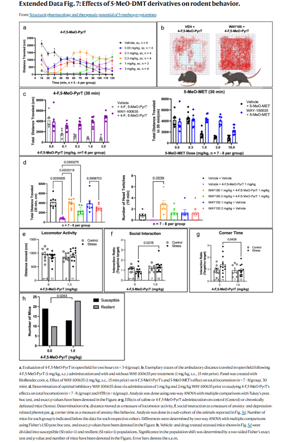
```

Now let's read in the data for Extended Data Figure 7d:

``` {r}
vehveh <- as_tibble(t(read_excel(path = "data/41586_2024_7403_MOESM5_ESM.xlsx", sheet = "ED Fig 7", range = "D35:K35", col_names = FALSE, .name_repair = "unique_quiet"))) # this code chunk one treatment group for this experiment at a time, because it is formatted very inconveniently
vehveh <- vehveh %>% # adds a "treatment" column and properly renames the "distance traveled" column
  mutate(Treatment = rep("Vehicle + Vehicle", times = nrow(vehveh)), Distance.Traveled.cm = V1) %>%
  filter(!is.na(Distance.Traveled.cm)) %>%
  select(Treatment, Distance.Traveled.cm)
vehmeo <- as_tibble(t(read_excel(path = "data/41586_2024_7403_MOESM5_ESM.xlsx", sheet = "ED Fig 7", range = "L35:S35", col_names = FALSE, .name_repair = "unique_quiet")))
vehmeo <- vehmeo %>%
  mutate(Treatment = rep("Vehicle + 4-F, 5-MeO-PyrT 1 mg/kg", times = nrow(vehmeo)), Distance.Traveled.cm = V1) %>%
  filter(!is.na(Distance.Traveled.cm)) %>%
  select(Treatment, Distance.Traveled.cm)
waymeo <- as_tibble(t(read_excel(path = "data/41586_2024_7403_MOESM5_ESM.xlsx", sheet = "ED Fig 7", range = "D38:K38", col_names = FALSE, .name_repair = "unique_quiet")))
waymeo <- waymeo %>%
  mutate(Treatment = rep("WAY-100,635 1 mg/kg + 4-F, MeO-PyrT 1 mg/kg", times = nrow(waymeo)), Distance.Traveled.cm = V1) %>%
  filter(!is.na(Distance.Traveled.cm)) %>%
  select(Treatment, Distance.Traveled.cm)
way2meo <- as_tibble(t(read_excel(path = "data/41586_2024_7403_MOESM5_ESM.xlsx", sheet = "ED Fig 7", range = "L38:S38", col_names = FALSE, .name_repair = "unique_quiet")))
way2meo <- way2meo %>%
  mutate(Treatment = rep("WAY-100,635 2 mg/kg + 4-F, MeO-PyrT 1 mg/kg", times = nrow(way2meo)), Distance.Traveled.cm = V1) %>%
  filter(!is.na(Distance.Traveled.cm)) %>%
  select(Treatment, Distance.Traveled.cm)
wayveh <- as_tibble(t(read_excel(path = "data/41586_2024_7403_MOESM5_ESM.xlsx", sheet = "ED Fig 7", range = "D41:K41", col_names = FALSE, .name_repair = "unique_quiet")))
wayveh <- wayveh %>%
  mutate(Treatment = rep("WAY-100,635 1 mg/kg + Vehicle", times = nrow(wayveh)), Distance.Traveled.cm = V1) %>%
  filter(!is.na(Distance.Traveled.cm)) %>%
  select(Treatment, Distance.Traveled.cm)
way2veh <- as_tibble(t(read_excel(path = "data/41586_2024_7403_MOESM5_ESM.xlsx", sheet = "ED Fig 7", range = "L41:S41", col_names = FALSE, .name_repair = "unique_quiet")))
way2veh <- way2veh %>%
  mutate(Treatment = rep("WAY-100,635 2 mg/kg + Vehicle", times = nrow(way2veh)), Distance.Traveled.cm = V1) %>%
  filter(!is.na(Distance.Traveled.cm)) %>%
  select(Treatment, Distance.Traveled.cm)
f7d1 <- tibble(Treatment = character(), Distance.Traveled.cm = numeric())
f7d1 <- f7d1 %>% # combines all separate treatments into a single usable table
  add_row(vehveh) %>%
  add_row(vehmeo) %>%
  add_row(waymeo) %>%
  add_row(way2meo) %>%
  add_row(wayveh) %>%
  add_row(way2veh)
print(head(f7d1))
```

``` {r}
vehveh <- as_tibble(t(read_excel(path = "data/41586_2024_7403_MOESM5_ESM.xlsx", sheet = "ED Fig 7", range = "D45:K45", col_names = FALSE, .name_repair = "unique_quiet"))) # this code chunk one treatment group for this experiment at a time, because it is formatted very inconveniently
vehveh <- vehveh %>% # adds a "treatment" column and properly renames the "distance traveled" column
  mutate(Treatment = rep("Vehicle + Vehicle", times = nrow(vehveh)), Head.Twitch.Response = V1) %>%
  filter(!is.na(Head.Twitch.Response)) %>%
  select(Treatment, Head.Twitch.Response)
vehmeo <- as_tibble(t(read_excel(path = "data/41586_2024_7403_MOESM5_ESM.xlsx", sheet = "ED Fig 7", range = "L45:S45", col_names = FALSE, .name_repair = "unique_quiet")))
vehmeo <- vehmeo %>%
  mutate(Treatment = rep("Vehicle + 4-F, 5-MeO-PyrT 1 mg/kg", times = nrow(vehmeo)), Head.Twitch.Response = V1) %>%
  filter(!is.na(Head.Twitch.Response)) %>%
  select(Treatment, Head.Twitch.Response)
waymeo <- as_tibble(t(read_excel(path = "data/41586_2024_7403_MOESM5_ESM.xlsx", sheet = "ED Fig 7", range = "D48:K48", col_names = FALSE, .name_repair = "unique_quiet")))
waymeo <- waymeo %>%
  mutate(Treatment = rep("WAY-100,635 1 mg/kg + 4-F, MeO-PyrT 1 mg/kg", times = nrow(waymeo)), Head.Twitch.Response = V1) %>%
  filter(!is.na(Head.Twitch.Response)) %>%
  select(Treatment, Head.Twitch.Response)
way2meo <- as_tibble(t(read_excel(path = "data/41586_2024_7403_MOESM5_ESM.xlsx", sheet = "ED Fig 7", range = "L48:S48", col_names = FALSE, .name_repair = "unique_quiet")))
way2meo <- way2meo %>%
  mutate(Treatment = rep("WAY-100,635 2 mg/kg + 4-F, MeO-PyrT 1 mg/kg", times = nrow(way2meo)), Head.Twitch.Response = V1) %>%
  filter(!is.na(Head.Twitch.Response)) %>%
  select(Treatment, Head.Twitch.Response)
wayveh <- as_tibble(t(read_excel(path = "data/41586_2024_7403_MOESM5_ESM.xlsx", sheet = "ED Fig 7", range = "D51:K51", col_names = FALSE, .name_repair = "unique_quiet")))
wayveh <- wayveh %>%
  mutate(Treatment = rep("WAY-100,635 1 mg/kg + Vehicle", times = nrow(wayveh)), Head.Twitch.Response = V1) %>%
  filter(!is.na(Head.Twitch.Response)) %>%
  select(Treatment, Head.Twitch.Response)
way2veh <- as_tibble(t(read_excel(path = "data/41586_2024_7403_MOESM5_ESM.xlsx", sheet = "ED Fig 7", range = "L51:S51", col_names = FALSE, .name_repair = "unique_quiet")))
way2veh <- way2veh %>%
  mutate(Treatment = rep("WAY-100,635 2 mg/kg + Vehicle", times = nrow(way2veh)), Head.Twitch.Response = V1) %>%
  filter(!is.na(Head.Twitch.Response)) %>%
  select(Treatment, Head.Twitch.Response)
f7d2 <- tibble(Treatment = character(), Head.Twitch.Response = numeric())
f7d2 <- f7d2 %>% # combines all separate treatments into a single usable table
  add_row(vehveh) %>%
  add_row(vehmeo) %>%
  add_row(waymeo) %>%
  add_row(way2meo) %>%
  add_row(wayveh) %>%
  add_row(way2veh)
print(head(f7d2))
```

And now Extended Data Figure 7e:

``` {r}
f <- read_excel(path = "data/41586_2024_7403_MOESM5_ESM.xlsx", sheet = "ED Fig 7", range = "C63:W65", col_names = FALSE, col_types = "text", .name_repair = "unique_quiet") # reads in the data table we need specifically
f <- t(f) # swaps columns with rows, so we can work with the table easier
f <- row_to_names(f, row_number = 1) # assigns proper names to columns
control <- rep("Control", times = 8)
stress <- rep("Stress", times = 12)
condition <- append(control, values = stress)
f[1:20] = condition # fills out missing values for stress condition
f <- as_tibble(f, .name_repair = "universal_quiet") # converts table to a format we can work with easier
f1 <- f %>%
  select(..4.F..5.MeO.PyrT...mg.kg., ...0) %>%
  mutate(Condition = ..4.F..5.MeO.PyrT...mg.kg., Distance.Moved.cm = as.numeric(...0)) %>%
  filter(!is.na(...0))
f1 <- f1 %>%
  mutate(Dosage = rep("0", times = nrow(f1))) %>%
  select(Condition, Dosage, Distance.Moved.cm) # separates all data points since each one is from a different subject, and makes an extra column that keeps track of treatment condition
f2 <- f %>%
  select(..4.F..5.MeO.PyrT...mg.kg., ..1.0) %>%
  mutate(Condition = ..4.F..5.MeO.PyrT...mg.kg., Distance.Moved.cm = as.numeric(..1.0)) %>%
  filter(!is.na(..1.0))
f2 <- f2 %>%
  mutate(Dosage = rep("1.0", times = nrow(f2))) %>%
  select(Condition, Dosage, Distance.Moved.cm)
f7e <- tibble(Condition = character(), Dosage = character(), Distance.Moved.cm = numeric())
f7e <- f7e %>% # combines all separate treatments into a single usable table
  add_row(f1) %>%
  add_row(f2)
print(head(f7e))
```

Extended Data Figure 7f:

``` {r}
f <- read_excel(path = "data/41586_2024_7403_MOESM5_ESM.xlsx", sheet = "ED Fig 7", range = "C53:W55", col_names = FALSE, col_types = "text", .name_repair = "unique_quiet") # reads in the data table we need specifically
f <- t(f) # swaps columns with rows, so we can work with the table easier
f <- row_to_names(f, row_number = 1) # assigns proper names to columns
control <- rep("Control", times = 8)
stress <- rep("Stress", times = 12)
condition <- append(control, values = stress)
f[1:20] = condition # fills out missing values for stress condition
f <- as_tibble(f, .name_repair = "universal_quiet") # converts table to a format we can work with easier
f1 <- f %>%
  select(..4.F..5.MeO.PyrT...mg.kg., ...0) %>%
  mutate(Condition = ..4.F..5.MeO.PyrT...mg.kg., Interaction.Ratio = as.numeric(...0)) %>%
  filter(!is.na(...0))
f1 <- f1 %>%
  mutate(Dosage = rep("0", times = nrow(f1))) %>%
  select(Condition, Dosage, Interaction.Ratio) # separates all data points since each one is from a different subject, and makes an extra column that keeps track of treatment condition
f2 <- f %>%
  select(..4.F..5.MeO.PyrT...mg.kg., ..1.0) %>%
  mutate(Condition = ..4.F..5.MeO.PyrT...mg.kg., Interaction.Ratio = as.numeric(..1.0)) %>%
  filter(!is.na(..1.0))
f2 <- f2 %>%
  mutate(Dosage = rep("1.0", times = nrow(f2))) %>%
  select(Condition, Dosage, Interaction.Ratio)
f7f <- tibble(Condition = character(), Dosage = character(), Interaction.Ratio = numeric())
f7f <- f7f %>% # combines all separate treatments into a single usable table
  add_row(f1) %>%
  add_row(f2)
print(head(f7f))
```

Extended Data Figure G:

``` {r}
f <- read_excel(path = "data/41586_2024_7403_MOESM5_ESM.xlsx", sheet = "ED Fig 7", range = "C58:W60", col_names = FALSE, col_types = "text", .name_repair = "unique_quiet") # reads in the data table we need specifically
f <- t(f) # swaps columns with rows, so we can work with the table easier
f <- row_to_names(f, row_number = 1) # assigns proper names to columns
control <- rep("Control", times = 8)
stress <- rep("Stress", times = 12)
condition <- append(control, values = stress)
f[1:20] = condition # fills out missing values for stress condition
f <- as_tibble(f, .name_repair = "universal_quiet") # converts table to a format we can work with easier
f1 <- f %>%
  select(..4.F..5.MeO.PyrT...mg.kg., ...0) %>%
  mutate(Condition = ..4.F..5.MeO.PyrT...mg.kg., Interaction.Ratio = as.numeric(...0)) %>%
  filter(!is.na(...0))
f1 <- f1 %>%
  mutate(Dosage = rep("0", times = nrow(f1))) %>%
  select(Condition, Dosage, Interaction.Ratio) # separates all data points since each one is from a different subject, and makes an extra column that keeps track of treatment condition
f2 <- f %>%
  select(..4.F..5.MeO.PyrT...mg.kg., ..1.0) %>%
  mutate(Condition = ..4.F..5.MeO.PyrT...mg.kg., Interaction.Ratio = as.numeric(..1.0)) %>%
  filter(!is.na(..1.0))
f2 <- f2 %>%
  mutate(Dosage = rep("1.0", times = nrow(f2))) %>%
  select(Condition, Dosage, Interaction.Ratio)
f7g <- tibble(Condition = character(), Dosage = character(), Interaction.Ratio = numeric())
f7g <- f7g %>% # combines all separate treatments into a single usable table
  add_row(f1) %>%
  add_row(f2)
print(head(f7g))
```

And finally, Extended Data Figure 7h:

``` {r}
f7h <- tibble(read_excel(path = "data/41586_2024_7403_MOESM5_ESM.xlsx", sheet = "ED Fig 7", range = "C68:E70", .name_repair = "unique_quiet"))
print(head(f7h))
```

## Statistical Replications/Reanalysis

### Figure 5b

``` {r}
#| out-width: "100%"
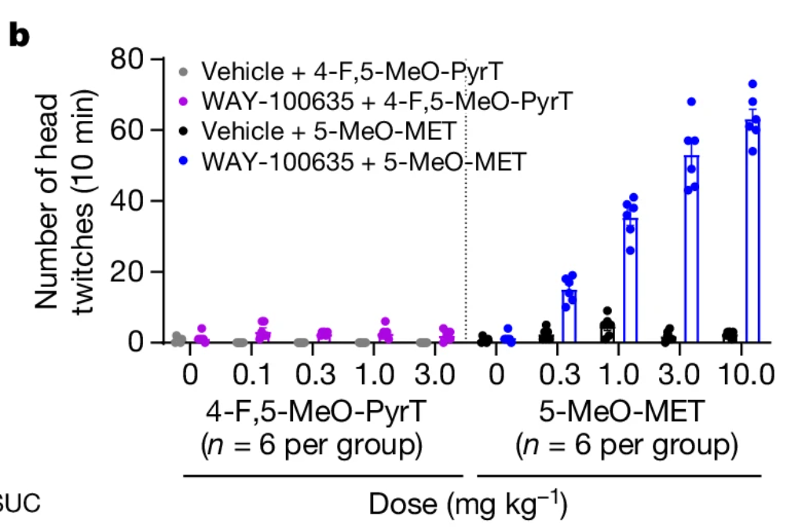
```

This data was not analyzed using a statistical test, but instead visually. Let's remake that:

``` {r}
plot1 <- ggplot(data = f5b1, aes(x = Dosage, y = Head.Twitch.Response, fill = Treatment)) +
  stat_summary(geom = "bar", fun = mean, position = "dodge") +
  ylim(0, 80) +
  theme(legend.position = "bottom") +
  scale_fill_manual("legend", values = c("Vehicle + 4-F,5-MeO-PyrT" = "gray", "WAY-100,635 + 4-F,5-MeO-PyrT" = "purple")) +
  geom_jitter(position = position_jitterdodge()) +
  stat_summary(geom = "errorbar", fun.data = mean_se, position = "dodge")
plot2 <- ggplot(data = f5b2, aes(x = Dosage, y = Head.Twitch.Response, fill = Treatment)) +
  stat_summary(geom = "bar", fun = mean, position = "dodge") +
  ylim(0, 80) +
  theme(legend.position = "bottom") +
  scale_fill_manual("legend", values = c("Vehicle + 5-MeO-MET" = "black", "WAY-100,635 + 5-MeO-MET" = "blue")) +
  geom_jitter(position = position_jitterdodge()) +
  stat_summary(geom = "errorbar", fun.data = mean_se, position = "dodge")
gridExtra::grid.arrange(plot1, plot2, nrow = 1)
```

Looks perfect! we have the error bars and individual data points too. And it's visually very clear that the only thing causing head twitches to any relevant degree is 5-MeO-DMT when it's combined with WAY-100635.

### Figure 5d

``` {r}
#| out-width: "100%"
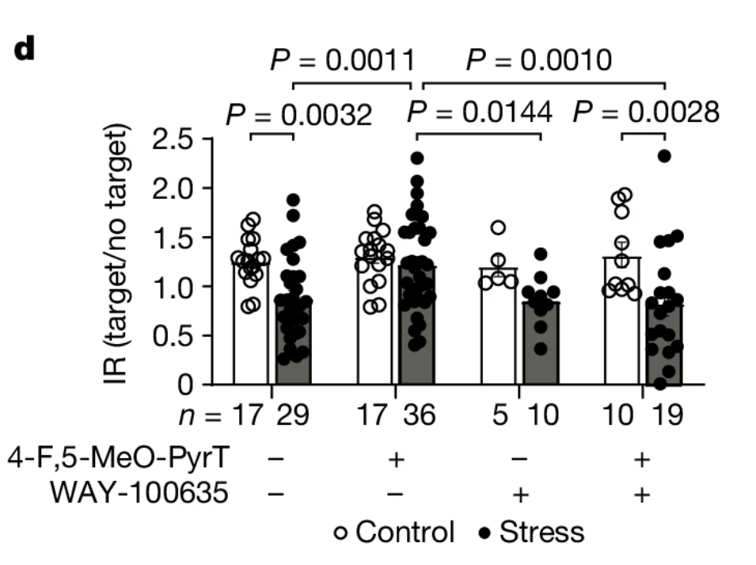
```

This first set of data was analyzed using a two-way ANOVA with multiple comparisons and, for post-hoc tests, Fisher's least significant difference tests.

First, let's make sure we have the correct group sizes:

``` {r}
for(i in unique(f5d$Treatment)) { # checks each treatment group
  for(j in unique(f5d$Condition)) { # checks each stress condition within each treatment group
    cat("Group Size for ", i, " ", j, ":", nrow(filter(f5d, Treatment == i & Condition == j)), "\n")
  }
}
```

Looks great! now let's graph it:

``` {r}
ggplot(data = f5d, aes(x = Treatment, y = Interaction.Ratio, fill = Condition)) +
  stat_summary(geom = "bar", fun = mean, position = "dodge") +
  theme(legend.position = "bottom") +
  geom_jitter(position = position_jitterdodge()) +
  stat_summary(geom = "errorbar", fun.data = mean_se, position = "dodge")
```

Now let's do that two-way ANOVA. It looks like they were trying to look at main effect of stress condition, main effect of treatment group, and any interaction effects between the two:

``` {r}
m1 <- aov(data = f5d, Interaction.Ratio ~ Condition * Treatment)
summary(m1)
```

It looks like there are main effects of condition and treatment, and no two-way interaction! This makes sense, since 4-F,5-MeO-PyrT was found to reverse the effect of stress on interaction ratio, and WAY-100635 is meant to prevent that reversal, so things start cancelling each other out when they combine. My p values are mostly in line with the authors'; the treatment factor is the only one that differs, and I can only explain it as being a typo at this point.

``` {r}
#| out-width: "100%"
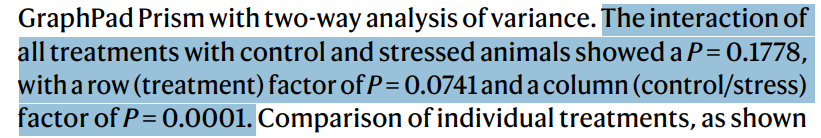
```

Anyway, let's move on to the Fisher's least significant difference tests:

``` {r}
print(LSD.test(m1, trt = "Condition"))
print(LSD.test(m1, trt = "Treatment"))
```

I am unable to retrieve p values for the Fischer's tests for some reason, but the groups analysis do seem to confirm that there is a main stress effect, and that 4-F,5-MeO-PyrT can rescue interaction ratio in stressed mice, but only in absence of WAY-100635.

### Figure 5e

``` {r}
#| out-width: "100%"
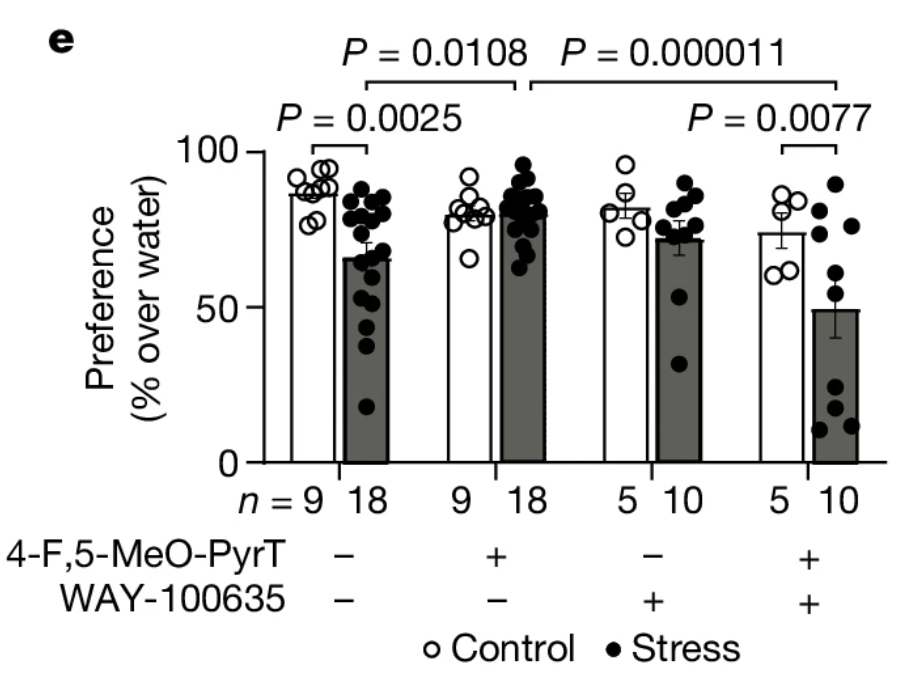
```

This next section did something similar, with two-way ANOVA and Fisher's LSDs. Let's start by checking our sample sizes again:

``` {r}
for(i in unique(f5e$Treatment)) { # checks each treatment group
  for(j in unique(f5e$Condition)) { # checks each stress condition within each treatment group
    cat("Group Size for ", i, " ", j, ":", nrow(filter(f5e, Treatment == i & Condition == j)), "\n")
  }
}
```

Great! Let's graph this one too:

``` {r}
ggplot(data = f5e, aes(x = Treatment, y = Sucrose.Preference, fill = Condition)) +
  stat_summary(geom = "bar", fun = mean, position = "dodge") +
  theme(legend.position = "bottom") +
  geom_jitter(position = position_jitterdodge()) +
  stat_summary(geom = "errorbar", fun.data = mean_se, position = "dodge")
```

We can do this one's two-way ANOVA now:

``` {r}
m2 <- aov(data = f5e, Sucrose.Preference ~ Condition * Treatment)
summary(m2)
```

Again, it looks like main effects of stress condition and treatment group, with no two-way interaction. The p value for the interaction effect is in line perfectly again, but condition and treatment are slightly off again.

``` {r}
#| out-width: "100%"

```

We can do the Fisher's least significant difference test again:

``` {r}
print(LSD.test(m2, trt = "Condition"))
print(LSD.test(m2, trt = "Treatment"))
```

And again, this confirms the main effects of condition and treatment, with 4-F,5-MeO-PyrT combined with WAY-100635 being the odd one out this time.

### Extended Data Figure 7d1

``` {r}
#| out-width: "100%"
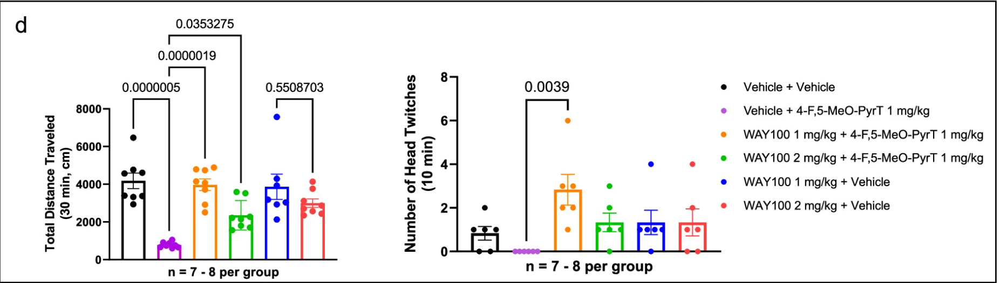
```

ED Fig 7d was done using one-way ANOVAs with multiple comparisons and Tukey's post-hoc test. Let's start by graphing it:

``` {r}
ggplot(data = f7d1, aes(x = Treatment, y = Distance.Traveled.cm)) +
  stat_summary(geom = "bar", fun = mean, position = "dodge") +
  theme(legend.position = "bottom") +
  geom_jitter(position = position_jitterdodge()) +
  stat_summary(geom = "errorbar", fun.data = mean_se, position = "dodge")
```

And now let's get into the ANOVA:

``` {r}
m3 <- aov(data = f7d1, Distance.Traveled.cm ~ Treatment)
summary(m3)
```

The authors did not report any statistics on the ANOVA, but there is a main effect of treatment!

Onto the Tukey's post-hoc tests:

``` {r}
posthoc <- TukeyHSD(m3, which = "Treatment")
posthoc
```

The comparable p values from this are (formatted as my calculated values vs the authors' reported values):

Vehicle-Vehicle, Vehicle-1 mg/kg 4-F,5-MeO-PyrT: 0.0000005 vs 0.0000006
1 mg/kg WAY100635 + 1 mg/kg 4-F,5-MeO-PyrT-1 mg/kg 4-F,5-MeO-PyrT: 0.0000019 vs 0.0000019
1 mg/kg WAY100635 + 1 mg/kg 4-F,5-MeO-PyrT-1 mg/kg 4-F,5-MeO-PyrT: 0.0353275 vs 0.0353275
2 mg/kg WAY100635-1 mg/kg WAY100635: 0.5508703 vs 0.5508703

In summary: The post-hoc tests look pretty good!

### Extended Data Figure 7d2

This one is also an ANOVA:

``` {r}
m4 <- aov(data = f7d2, Head.Twitch.Response ~ Treatment)
summary(m4)
```

No ANOVA statistics reported by the authors again, but there's significance again!

Onto the Tukey's post-hoc tests:

``` {r}
posthoc <- TukeyHSD(m4, which = "Treatment")
posthoc
```

The only comparison we can check is 1 mg/kg WAY-100635-1 mg/kg 4-F,5-MeO-PyrT, whose calculated p value is... 0.6793023. Way off from 0.0039 for some reason.

### Extended Data 7e

``` {r}
#| out-width: "100%"
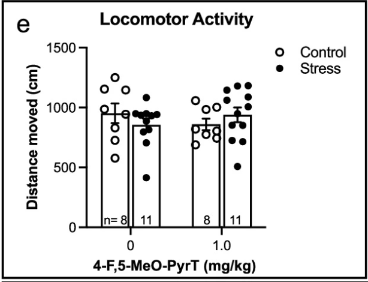
```

ED Fig 7e was analyzed by two-way ANOVA and Fisher's LSD post-hoc test. Let's graph it:

``` {r}
ggplot(data = f7e, aes(x = Dosage, y = Distance.Moved.cm, fill = Condition)) +
  stat_summary(geom = "bar", fun = mean, position = "dodge") +
  theme(legend.position = "bottom") +
  geom_jitter(position = position_jitterdodge()) +
  stat_summary(geom = "errorbar", fun.data = mean_se, position = "dodge")
```

Now let's do the ANOVA:

``` {r}
m5 <- aov(data = f7e, Distance.Moved.cm ~ Condition * Dosage)
summary(m5)
```

No statistics were reported for this by the authors, but this is no surprise given the lack of significance markers on their graph. Onto the Fisher's post-hoc tests:

``` {r}
print(LSD.test(m5, trt = "Condition"))
print(LSD.test(m5, trt = "Dosage"))
```

And like the ANOVA alluded to, the post-hoc groups confirmed there are not significant differences between the treatments and dosages.

### Extended Data 7f

``` {r}
#| out-width: "100%"
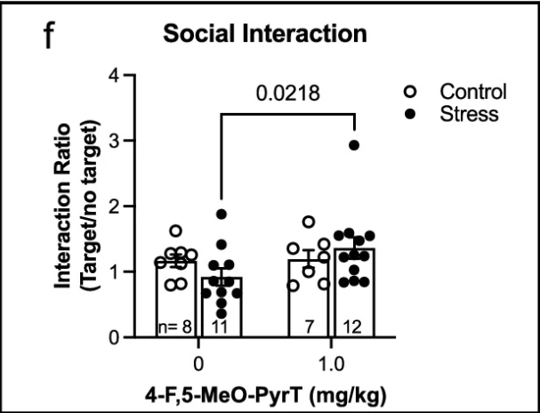
```

ED Fig 7f was also analyzed using two-way ANOVA and Fisher's least-significant difference tests. Onto graphing it:

``` {r}
ggplot(data = f7f, aes(x = Dosage, y = Interaction.Ratio, fill = Condition)) +
  stat_summary(geom = "bar", fun = mean, position = "dodge") +
  theme(legend.position = "bottom") +
  geom_jitter(position = position_jitterdodge()) +
  stat_summary(geom = "errorbar", fun.data = mean_se, position = "dodge")
```

And onto the ANOVA:

``` {r}
m6 <- aov(data = f7f, Interaction.Ratio ~ Condition * Dosage)
summary(m6)
```

This didn't provide any statistical significance, but there is still a chance to see something in the Fisher post-hoc:

``` {r}
print(LSD.test(m6, trt = "Condition"))
print(LSD.test(m6, trt = "Dosage"))
```

And while no p values are printed by this test, the groups reveal there is no significant difference between the groups either.

### Extended Data Figure 7g

``` {r}
#| out-width: "100%"
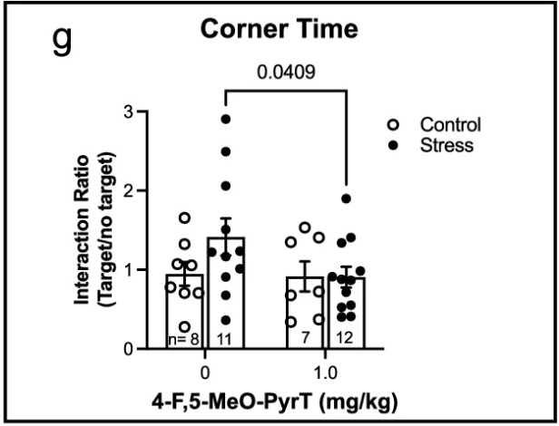
```

Again, this one was analyzed using two-way ANOVA and a Fisher's LSD post-hoc test.

``` {r}
ggplot(data = f7g, aes(x = Dosage, y = Interaction.Ratio, fill = Condition)) +
  stat_summary(geom = "bar", fun = mean, position = "dodge") +
  theme(legend.position = "bottom") +
  geom_jitter(position = position_jitterdodge()) +
  stat_summary(geom = "errorbar", fun.data = mean_se, position = "dodge")
```

The two-way ANOVA:

``` {r}
m7 <- aov(data = f7g, Interaction.Ratio ~ Condition * Dosage)
summary(m7)
```

No significance here again. Let's look at the Fisher's post-hoc:

``` {r}
print(LSD.test(m7, trt = "Condition"))
print(LSD.test(m7, trt = "Dosage"))
```

And still no significance, with no explanation for the significance marker on the authors' figure.

### Extended Data Figure 7h

``` {r}
#| out-width: "100%"
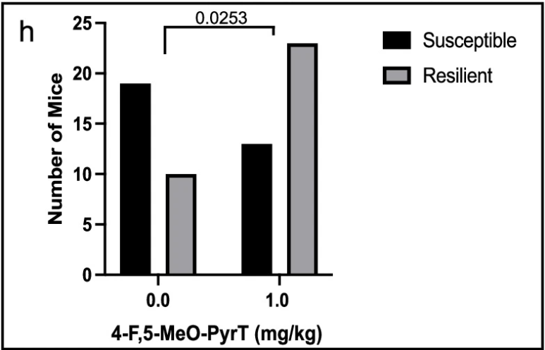
```

This data was analyzed using a two-sided Fisher's exact test:

``` {r}
mat <- matrix(c(19, 13, 10, 23), nrow = 2, ncol = 2, byrow = TRUE)
fisher.test(mat)
```

I was forced to write the numbers in manually instead of being able to call them from the tibble, but the p value is right on the dot!

## Summary/Discussion

In sum, I was not entirely able to replicate the analyses in the study. A major limiting factor was the authors not speaking on the specifics of the statistical tests or corrections they were using, as well as them simply not reporting the results of the statistical tests they ran. This may have been what led to differing p values between my calculations and the authors' report--if I knew what type of ANOVA they ran, or if they were using p value corrections, I may have been able to figure the rest out. I also had issues getting p values out of the function I was using for the Fisher's LSD; the best I could get from it was grouping, which was helpful, but there were no hard numbers for me to go off of. I think an important detail here is that the authors were using GraphPad Prism, which automates and simplifies much of the analysis, meaning the authors may have simply not considered the minutiae of their statistical tests.

## References

Warren, A.L., Lankri, D., Cunningham, M.J., Serrano, I.C., Parise, L.F., Kruegel, A.C., Duggan, P., Zilberg, G., Capper, M.J., Havel, V., Russo, S.J., Sames, F., & Wacker, D. (2024). Structural pharmacology and therapeutic potential of 5-methoxytrypamines. *Nature, 630*, 237-246. https://doi.org/10.1038/s41586-024-07403-2